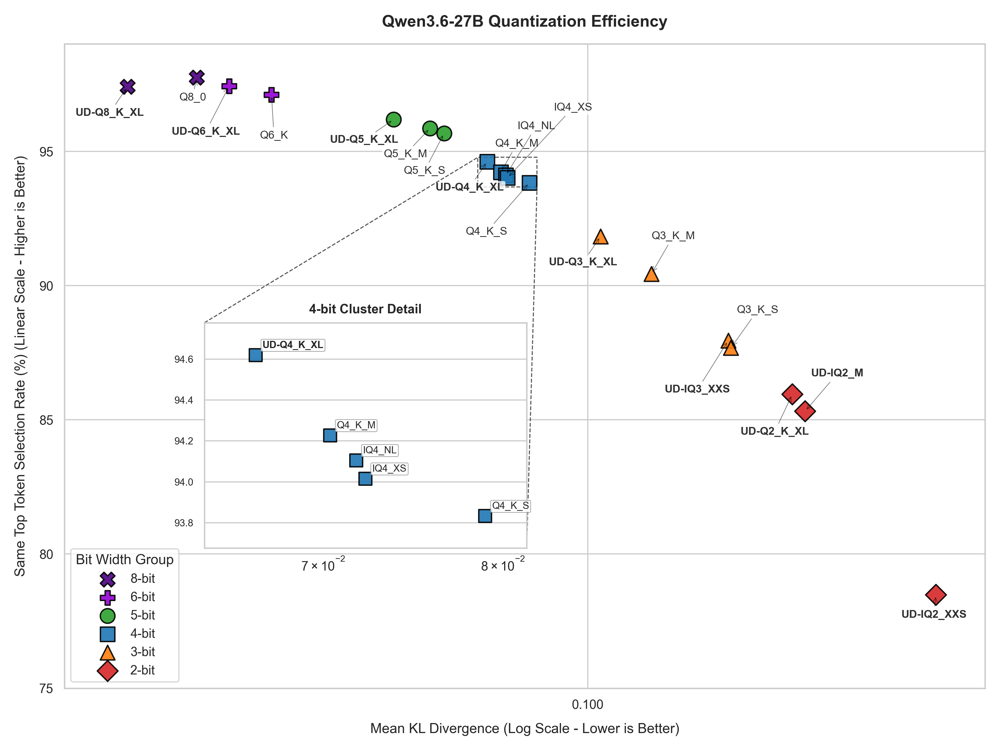
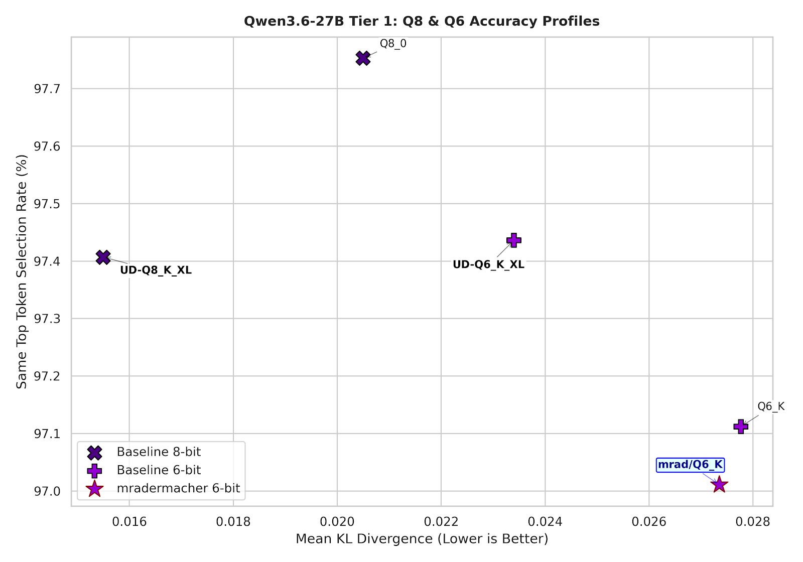
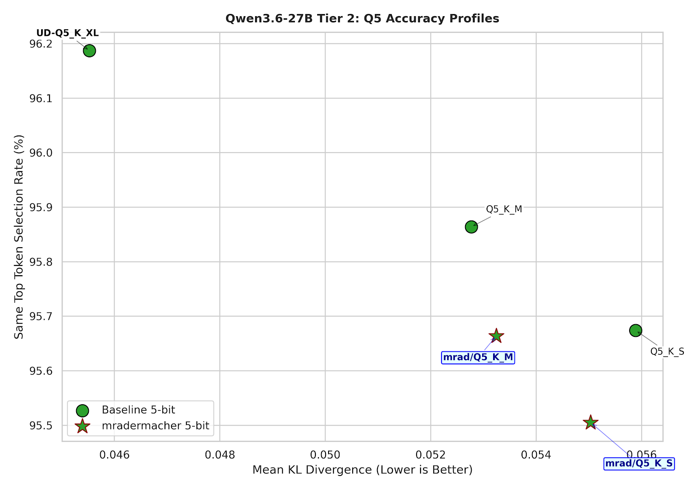
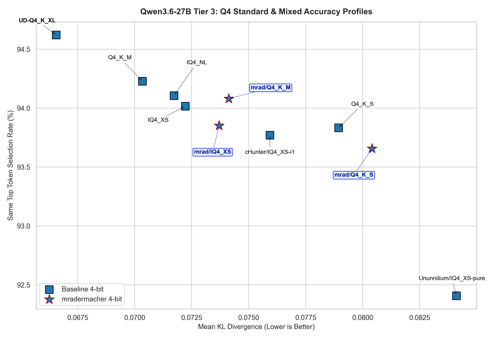
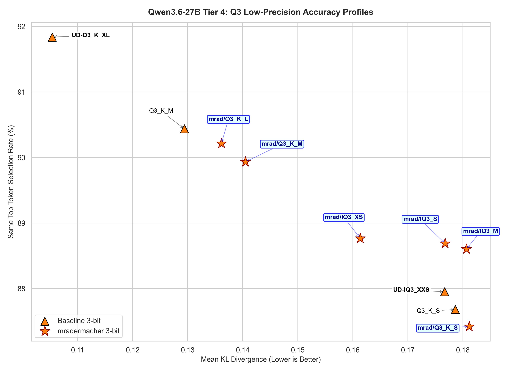

# 05.29.2026 - AI/Qwen3.6 27B Quantization Benchmark

This is my attempt to benchmark and compare the quality of some of the well known Qwen3.6 27B quantizations on HuggingFace (unsloth, mradermacher, IQ4\_XS from cHunter789 and Ununnilium), from Q8 all the way down to Q2.

## Measurement method

I'm using llama.cpp's `llama-perplexity` to measure the **mean KLD** and **Same Top P Percentage** between the quantized model and the base (BF16 version).

All runs were using the same context length of 8192 tokens, KV cache quantized to q8\_0 so I can make sure the entire model fit in the GPU.

First, I obtained the logits of the BF16 version with this command:

```
llama-perplexity -m <MODEL_PATH> \
	-f wiki.test.raw -c 8192 -ngl 99 -ctk q8_0 -ctv q8_0 \
	--kl-divergence-base logits-bf16.dat
	--kl-divergence
```

Then for each model, I ran the test with:

```
llama-perplexity -m BF16/Qwen3.6-27B-BF16-00001-of-00002.gguf \
	-f wiki.test.raw -c 8192 -ngl 99 -ctk q8_0 -ctv q8_0 \
	--kl-divergence-base logits-bf16.dat
```

## Understand KLD and Same Top P

To understand the test result, it would be useful to understand the difference between the two metrics I used.

When an LLM predicts the next word of a given prompt, for example **"Today I will do my"**, it looks at its entire vocabulary and assigns a confidence score to every single token. Then samples the top tokens and pick the final one, based on the given temperature.

- **KL Divergence (KLD)** measures how much the confidence distribution of the quantized model drifts away from the base. In this example, the base model might assign 90% confidence to "homework", 5% to "bike" and 1% to "banana". But the poorly quantized one might give 50% to "homework", 30% to "bike" and "20%" to "banana".
- **Same Top P** tracks how often the quantized model picks the same token as the base model. In this example, the model might just pick "homework" as the next token for the prompt.

So, while you might get a good token choice with the quantized model (**Same Top P** is high), it's important to look at the **Mean KLD** to see how stable the inner probability of the model is, the lower, the better.
 
## Benchmark result

### Unsloth's quantization



Nothing special, higher quants are better than lower quants. Q6 to Q8 are pretty much lossless. You can see Q8\_0 has a higher **Same Top P**, but underlying, the **Mean KLD** tells us that UD-Q8\_K\_XL is better. Anything below Q4 are for the desperate, like the 5060ti 16GB club.

The 4-bit cluster is a bit more interesting. Different people may have a different take on this, but to me, Q4\_K\_XL is a good quality-compromise if you can afford the VRAM. If you're tight, IQ4\_XS could serve you well, IQ4\_NL is not much difference. And in that case, there's no need to stretch for Q4\_K\_M. You can skip Q4\_K\_S.

From Q3\_K\_XL, the quality degradation is more drastic. The KLD went all above 0.1 and matching token selection dropped to 90-85% can tell a lot about the instability.

### mradermacher's and other quants

I've seen people mention mradermacher's i1 quants here and there, and also IQ4\_XS quants from cHunter789 and Ununnilium. I have been personally using Ununnilium's IQ4\_XS for a while now. So I want to put them all on the same table to see how they fit. But a single diagram will not be enough so I will break them into 4 groups: Q8-Q6, Q5, Q4 and Q3-below.

#### 8-bit and 6-bit quantization



mradermacher's Q6\_K seems to be a clear winner over Unsloth's Q6\_K here. The mean KLD is near perfect (0.027352), and 97.011% token selection match.

#### 5-bit quantization



In this group, Unsloth is a winner. With about 300-500MB difference in size, you can skip Q5\_K\_S and go for Q5\_K\_M. Unsloth's Q5\_K\_M is clearly better in both matching token selection and KLD.

#### 4-bit quantization



Unsloth beats all of the 4-bit quants here. But if you are looking for some alternative quants to save VRAM, like ones on 16GB, pay attention to IQ4\_XS (it will help but of course, you will not be able to get above 65k context window).

mradermacher's IQ4\_XS is a clear winner among all the other IQ4\_XS quants, but at 15.1 GB, it would be a bit tight. cHunter's IQ4\_XS is also very good at 14.7 GB.

#### 3-bit and below



Again, mradermacher's quants filled in the gap between Unsloth's quants here, so you get a bit more choice, but tbh, at this range, you better off with Unsloth's Q3\_K\_XL or at least Q3\_K\_M.

I was very interested to see how some new quants like IQ3\_S, IQ3\_M perform, but they turned out a bit disappointed.

## Raw benchmark data

If you are interested, here's the raw benchmark data table after all the run.

| Quantization           | Mean PPL(Q) | Mean KLD | RMS Δp (%) | Same top p (%) |
|------------------------|-------------|----------|------------|----------------|
| UD-Q8_K_XL             | 6.569706    | 0.015495 | 2.448      | 97.407         |
| Q8_0                   | 6.567807    | 0.020497 | 2.701      | 97.753         |
| UD-Q6_K_XL             | 6.541421    | 0.023398 | 2.903      | 97.436         |
| mradermacher/Q6_K      | 6.541627    | 0.027352 | 3.045      | 97.011         |
| Q6_K                   | 6.566514    | 0.027766 | 3.014      | 97.112         |
| UD-Q5_K_XL             | 6.625155    | 0.045526 | 4.021      | 96.187         |
| Q5_K_M                 | 6.658295    | 0.05277  | 4.26       | 95.864         |
| mradermacher/Q5_K_M    | 6.630279    | 0.053246 | 4.372      | 95.664         |
| mradermacher/Q5_K_S    | 6.613859    | 0.055034 | 4.476      | 95.505         |
| Q5_K_S                 | 6.652629    | 0.055888 | 4.414      | 95.674         |
| UD-Q4_K_XL             | 6.647006    | 0.06656  | 5.023      | 94.621         |
| Q4_K_M                 | 6.672841    | 0.070345 | 5.334      | 94.228         |
| IQ4_NL                 | 6.619131    | 0.071724 | 5.497      | 94.106         |
| IQ4_XS                 | 6.61994     | 0.072223 | 5.481      | 94.016         |
| mradermacher/IQ4_XS    | 6.611545    | 0.073705 | 5.648      | 93.852         |
| mradermacher/Q4_K_M    | 6.685347    | 0.074124 | 5.507      | 94.08          |
| cHunter/IQ4_XS-i1      | 6.656157    | 0.075933 | 5.645      | 93.77          |
| Q4_K_S                 | 6.690623    | 0.078947 | 5.72       | 93.833         |
| mradermacher/Q4_K_S    | 6.642023    | 0.080407 | 5.825      | 93.657         |
| Ununnilium/IQ4_XS-pure | 6.765894    | 0.084115 | 6.127      | 92.407         |
| UD-Q3_K_XL             | 6.620281    | 0.105386 | 7.077      | 91.837         |
| Q3_K_M                 | 6.453757    | 0.129404 | 7.893      | 90.437         |
| mradermacher/Q3_K_L    | 6.482496    | 0.136127 | 8.116      | 90.213         |
| mradermacher/Q3_K_M    | 6.481299    | 0.140487 | 8.424      | 89.934         |
| mradermacher/IQ3_XS    | 6.981601    | 0.161364 | 9.182      | 88.767         |
| UD-IQ3_XXS             | 6.994512    | 0.176688 | 9.626      | 87.953         |
| mradermacher/IQ3_S     | 7.405328    | 0.176782 | 9.637      | 88.689         |
| Q3_K_S                 | 7.068685    | 0.178631 | 9.61       | 87.681         |
| mradermacher/IQ3_M     | 7.454224    | 0.180647 | 9.824      | 88.603         |
| mradermacher/Q3_K_S    | 6.910989    | 0.181172 | 9.82       | 87.422         |
| UD-Q2_K_XL             | 7.316461    | 0.229068 | 11.399     | 85.95          |
| UD-IQ2_M               | 7.468708    | 0.241252 | 11.91      | 85.319         |
| UD-IQ2_XXS             | 8.507239    | 0.40986  | 16.708     | 78.483         |

---

There are many more Qwen3.6 27B quantizations on HuggingFace, like ones from bartowski, huihui,... within my time budget (not money budget, since I'm basically using modal.com's free monthly credit :P), I cannot benchmark them all.

If you are interested in doing your own benchmark, I also attached the script here so you can run it on your own.

→ [kld.py](https://gist.github.com/huytd/ac6457b4581598a198c027e4051380de)

This script was written specifically to benchmark Qwen3.6 27B, please feel free to modify it as you need. The instruction to run is inside the script, please read the code before running.

Thanks for reading this far!
