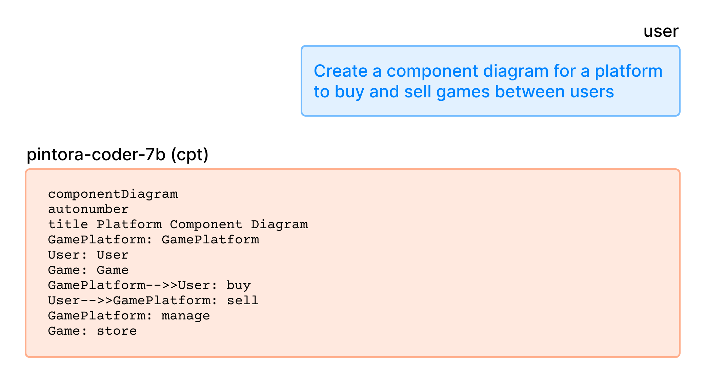
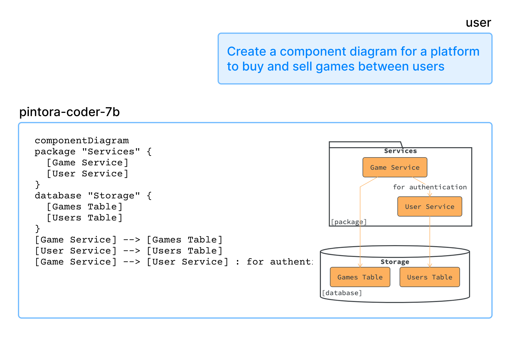
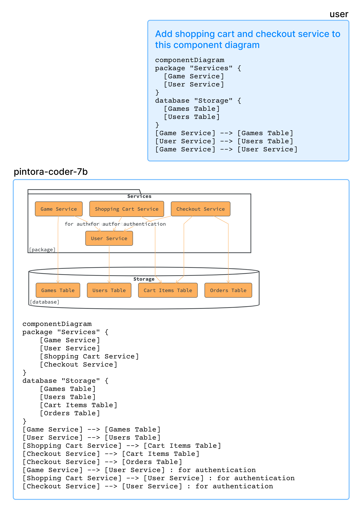

# 12.01.2025 - AI/Teaching an LLM a Niche Diagraming Language

Text-to-diagram seems to be an area that has been solved perfectly by LLMs, but only with popular languages like Mermaid or PlantUML. There are many other less popular diagramming languages like D2, Structurizr, or Pintora. I want to see how far I can go teaching an LLM one of these languages, and [Pintora](https://pintorajs.vercel.app/) seems like a nice option to pick because I know there will not be a lot of LLMs trained with this language. At least, not the small ones.

## Project goal

So, I set out the goal for this training project. It will be an LLM that has the ability to work with Pintora diagrams, for the following tasks:

- Generating diagrams from scratch
- Editing any existing diagram

## Picking the base model

I also limit the scope of this project to models that are smaller than 30B, simply because I do not have enough resources to train anything bigger than that.

Having experimented with 4B models and smaller, I found that these models are not really suitable for either a code-generating task or instruction following in a long conversation. A 7B-14B would be a good choice. I also want to base it off a coding model, hoping that it will be, well, code-smart.

Gemma-3 only has 4B and 27B. The smallest Codestral model is 22B. Ministral 3 was not released until 3 days after the writing of this post. I don't want to deal with thinking mode, so Qwen3 is also out of the list. After a lot of consideration, I picked Qwen2.5-Coder-7B. In 2025, it's like centuries old in terms of LLM-years, but whatever.

To confirm that Qwen2.5-Coder does not have any knowledge of Pintora, I tried to run it with the following prompt:

```
create a pintora component diagram for a website like twitter
```

And yes, the model proceeded to generate a very well-made... PlantUML diagram:

```
Below is a component diagram using Pintora syntax. You can copy and paste this into a Pintora editor to visualize it.

@startuml
!define RECTANGLE class

title Twitter Component Diagram

RECTANGLE "User Interface" as UI {
  RECTANGLE "Header" as Header
  RECTANGLE "Footer" as Footer
  ...
```

## The training plan

Since we're teaching the model a new language, we will need to train in two phases:

- **Phase 1: Continued Pretraining (CPT)** - We will feed the model a bunch of Pintora diagrams, so the model can learn the language's syntax, recognize grammar structure, etc.
- **Phase 2: Instruction Finetune (IFT)** - Then we will train the model on some diagram generating/editing instructions, so it can learn how to use the new language's knowledge on specific tasks.

I will use Unsloth's [training notebook](https://docs.unsloth.ai/basics/continued-pretraining), since it supports 4-bit quantized LoRA training, that helped training faster and using less memory.

## Data preparation

First thing's first, I need a dataset that I can use in both the CPT and IFT phases. I will go for the minimum amount of data needed (around 1000-1500 rows).

Pintora supports different kinds of diagrams: Sequence, ER, Component, Activity, Mindmap, Gantt, Class,... I will need a diverse number of data for each case, so that's about 150-200 rows per diagram type.

I want the model to have an ability to either generate a diagram from scratch or edit an existing diagram, so the dataset should also contain some examples that have an input diagram.

The plan is, each row will contain three fields:
- **instruction**: the description of what type of diagram the user wants to create
- **input**: an optional input diagram code for editing
- **output**: the final output code that the model should generate

With that clear plan, I started typing out each row, and after about 5 rows, I gave up... This kind of labor is not productive at all!

Why not just grab some code that people already created? I started searching on Github to see how much Pintora code there is. Not much, there were like 5 or 6 repositories that had some diagram code. Also, I don't like the idea of stealing someone's code without asking for their permission, not to mention, if I actually asked, I'm not sure how many of them would respond.

So, the last resort is to generate training data using AI! There's not much to talk about this step. The trick is to write an over-detailed prompt that includes all the syntax documentation, examples,... then some patience to beg the AI agent every 50 entries, threatening it that an alien Godzilla will destroy the Golden Gate Bridge if it's not completing its job.

At the end of the begging process, I ended up with about 2000 data entries. The result was not great at all, both Gemini 3 Pro and Claude Sonnet 4.5 generated a lot of syntactically incorrect code and a lot of duplicated entries.

To clean it up, I wrote a script to merge every row that has the same `output` column into one, and then, for each row, use the `@pintora/cli` tool to render the actual diagram, removing any rows where the `output` code cannot be used.

In the end, I was left with 1000 rows for CPT and 500 rows for IFT. If you are interested, they are available on Hugging Face, links are at the bottom of the post.

## Training

I started the training process on Google Colab (using a single 16GB T4 GPU) and quickly ran into an OOM issue. The situation was not getting any better with Kaggle's 2xT4 GPUs. So I ended up renting a 48GB A40 on Runpod for $0.4/hr.

It turned out that even for a 7B model with 4-bit QLoRA, my training script took about 19.33GB of VRAM to run, which was too much for 16GB of a T4 (the actual available VRAM was even less than that). But it was an unnecessary problem.

Theoretically, since Pintora language still uses keywords that already exist in most English-based programming languages, the model did not need to learn any new tokens. I could save about 5GB-6GB of VRAM needed by removing the `embed_tokens` and `lm_head` from the `target_modules`.

```python
model = FastLanguageModel.get_peft_model(
	model,
	r = 64, 
	target_modules = [
		"q_proj", "k_proj", "v_proj", "o_proj", 
		"gate_proj", "up_proj", "down_proj",
		"embed_tokens", "lm_head", # could have removed this
	],
	lora_alpha = 64,
	lora_dropout = 0.05,
	use_gradient_checkpointing = "unsloth",
	...
)
```

Back to the training process. After the CPT phase, I ran a test to see how well the model learned the syntax.



Since it started to pick up some syntax characteristic of Pintora, the diagram code is still syntactically incorrect.

In the next step, I loaded the `pintora-edit-instruct` dataset, with each entry formatted with this `edit_prompt`, and started the IFT phase.

```
edit_prompt = """Pintora Diagram Edit Instruction

### Instruction:
{instruction}
{input}

### Response:
{output}
"""
```

After this step, the model already learned to generate more accurate and syntactically correct code, for both generating from scratch and editing tasks.

**Generate diagram from scratch**



**Editing existing diagram**



So to this point, I have successfully taught Qwen2.5-Coder how to generate Pintora diagrams instead of spitting out random Mermaid/PlantUML diagrams. But how well has it learned?

## Evaluation for accuracy

To quickly evaluate the accuracy of the generated diagram (not the quality), I ~~vibed~~ created a script to use the model to generate with some randomized prompts:

```python
...

entities = [
	'User', 'Client', 'WebApp', 'Backend', 'Server', 'Database', 'AuthService',
	'PaymentGateway', 'Cache', 'Redis', 'Worker', 'TaskQueue', 'Frontend',
	'API Gateway', 'OrderSystem', 'Inventory', 'NotificationSvc', 'Logger', 'MetricsSvc'
]
actions = [
	'requests login', 'fetches data', 'updates record', 'processes payment',
	'validates token', 'sends email', 'renders view', 'queries index',
	'health check', 'ack signal', 'authenticates user', 'writes to log',
	'queries for user profile', 'returns 200 OK', 'returns 404 Not Found',
	'submits form', 'enqueues job', 'dequeues job', 'generates report'
]
diagram_types = ['sequenceDiagram', 'componentDiagram', 'activityDiagram']

def create_from_scratch_task():
    d_type = random.choice(diagram_types)
    num_interactions = random.randint(1, 3)
    interactions = []
    for _ in range(num_interactions):
        src, dst = random.sample(entities, 2)
        action = random.choice(actions)
        interactions.append(f"{src} {action} to {dst}")
    prompt_desc = ", and then ".join(interactions)
    instruction = f"Create a {d_type} that shows: {prompt_desc}."
    output_code = model.generate(instruction)
    return [instruction, "", output_code]

for i in range(1000):
	create_from_scratch_task()
	...
```

Some example result:

|instruction                                                                        |input                                                |output                                                                                        |
|-----------------------------------------------------------------------------------|-----------------------------------------------------|----------------------------------------------------------------------------------------------|
|Create a activityDiagram that shows: PaymentGateway returns 404 Not Found to...    |                                                     |activityDiagram start :Worker requests PaymentGateway; if (PaymentGateway returns 404)...     |
|Add a step where User health check to MetricsSvc.                                  |sequenceDiagram Cache->>User: enqueues job           |sequenceDiagram Cache->>User: enqueues job User->>MetricsSvc: health check                    |
|Add a step where PaymentGateway health check to Inventory.                         |sequenceDiagram Worker->>PaymentGateway: enqueues job|sequenceDiagram Worker->>PaymentGateway: enqueues job PaymentGateway->>Inventory: health check|

Then, I use the same technique in the data preparation step, deduplicate the result, and parse each `output` code with the `@pintora/cli` command.

In the end, out of 996 diagrams, we have 139 diagrams with syntax errors and 857 diagrams successfully rendered. That gives us **86%** accuracy, not bad for such a really small amount of training data.

## Final thoughts

There were a lot of learnings for me during this experiment, and countless mistakes that I could have done better, but ultimately, I had a lot of fun. Maybe I'll try to tackle the accuracy next with RL, I heard many good and bad things about it and I must give it a try.

I am also interested in this music programming language called [Strudel](https://strudel.cc/), and it would be fun to train an LLM for it.

In the meantime, if you are interested, here's the model (with GGUF) and the datasets, as well as the eval result below:

**Model:**
- https://huggingface.co/huytd189/pintora-coder-7b 
- https://huggingface.co/huytd189/pintora-coder-7b-gguf (GGUF - F16, Q8, Q4_K_M)

**Dataset:**
- https://huggingface.co/datasets/huytd189/pintora-instruct
- https://huggingface.co/datasets/huytd189/pintora-edit-instruct

**Eval result:**
- [pintora_eval.csv](_meta/pintora_eval.csv)
- [pintora_eval_bad.csv](_meta/pintora_eval_bad.csv)
- [pintora_eval_good.csv](_meta/pintora_eval_good.csv)

<details>
<summary>Now it's time for an ad if you don't mind ;)</summary>
If you want to try AI-assisted diagramming yourself, check out my project, <a href="https://chatuml.com">ChatUML</a>. It's designed to turn text into diagrams instantly. You can grab 60% off right now using the code <b>PINTORA</b>!
</details>
